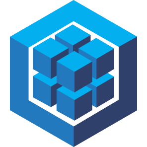

# Olá. Bem-vindo(a) :punch:
## me chamo Leonardo
### 🌍 :brazil:, Sul de minas

### 👩‍💻 Estudando atualmente na [Trybe](https://www.betrybe.com/).

  ```json:
  modulos: [
    { "id": 1, "name": "Fundamentos", "status": "concluído" },
    { "id": 2, "name": "Front-end", "status": "concluído" }, 
    { "id": 3, "name": "Back-end", "status": "concluído" },
    { "id": 4, "name": "Ciência da Computação", "status": "processando" },
  ]
  ```
### 🧠 Estou aprendendo:
  - Python
  - AWS

### 📫 Entre em contato:

[](https://www.linkedin.com/in/leonardomonti/)
[](mailto:contatoleomonti@gmail.com)

---

### 🛠️ ~/ code .

###
<div style="display: flex; justify-content: flex-start; gap: 5px;"> 
<br>
  

  

  

  

  

  

  

  

  

  

  

  
<br>
</div>


---


---


